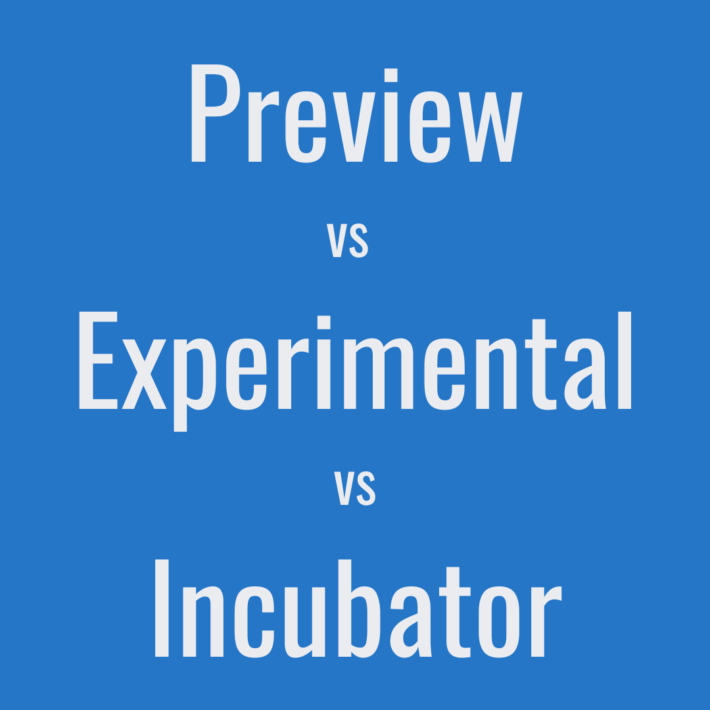
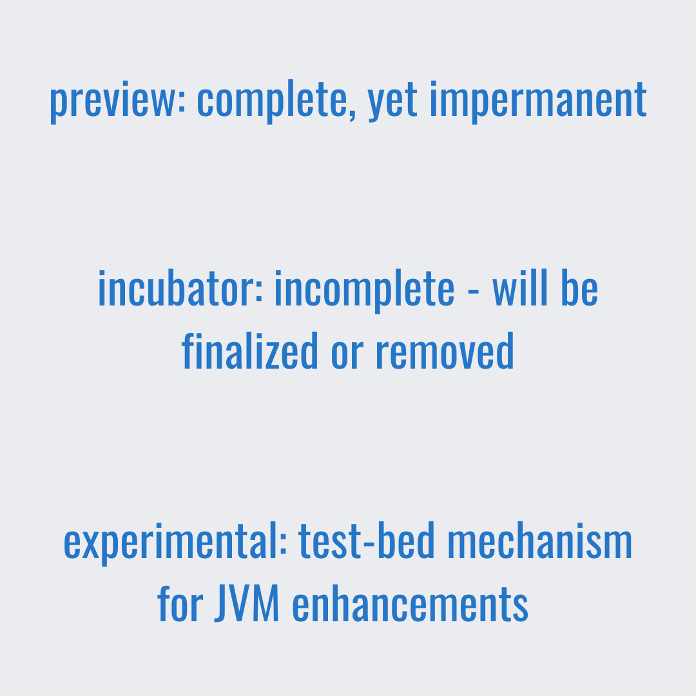

# Key difference between Preview, Experimental and Incubator in Java

All three of them: preview, experimental, and incubating features are aimed to gather feedback on new JDK functionality. 
Considering millions of people relying on and trusting Java, new features must be well designed in a clear and complete manner, 
be reliable and maintainable, with the highest possible quality.  

Keeping that in mind, it is completely necessary to gather developer's feedback in advance on nontrivial and having huge impact features
to refine those features and reach the expected quality level.  

If Preview Feature, Incubator module and Experimental feature are intend to get a feedback - what is the difference between them?

# Key Takeaways 
  

  
Put it shortly:
- Preview: complete, yet impermanent
- Incubator: incomplete - will be finalized or removed
- Experimental: test-bed mechanism for JVM enhancements  

JEP 12 says, that _preview_ feature is a new feature of the Java language, Java Virtual Machine, 
or Java SE API that is **fully** specified, **fully** implemented, and yet impermanent.

For _incubator_ according JEP 11, such modules are means of putting **non-final** APIs and **non-final** tools in the hands of developers, 
while the APIs/tools progress towards either **finalization** or **removal** in a future release.  

There is no JEP governing _experimental_ features. Experimental features are **Java Virtual Machine** enhancements and followed its release
convention rather that some formal process. Almost all experimental features known so far has been made in HotSpot 
and are related to Garbage Collector modifications, with exclusion for 317 and 410, witch are changes for AOT and JIT compiler.
But anyway, that is actually also JVM changes.  

