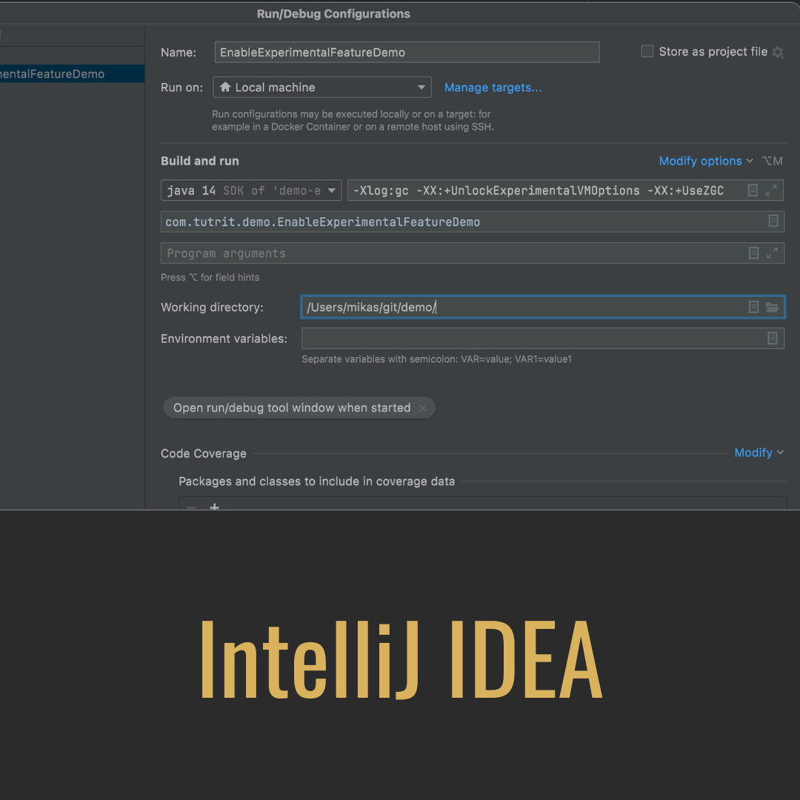

# Java Experimental Features

<div component="text-block">
Java is not only about language, it is also about application execution on desktops and servers. It is Java virtual machine, 
developed by Sun Microsystems and now maintained and distributed by Oracle Corporation, called HotSpot (released as Java HotSpot Performance Engine),
is responsible to do that.  

There is Java Experimental feature mechanism exist to test and get feedback on HotSpot enhancements.
Unlike JEP 12 for preview features of JEP 11 for incubator modules, there is no JEP governing experimental features.
The process for experimental features is more like established HotSpot convention than a formal process.  

So, an experimental feature is a test-bed mechanism used to gather feedback on nontrivial HotSpot enhancements, and here
how it could be enabled.

</div>

# The Demo Application

<div component="text-block">

There are very few changes in Java made as Experimental feature. For this demo _JEP 333: ZGC: A Scalable Low-Latency 
Garbage Collector (Experimental)_ has been chosen, released with 11 version of Java.

> ZCG for Windows and macOS was released in Java 14.  
> If this demo executes on other than Linux OS, use Java 14 instead of Java 11. 

Since Garbage Collector has nothing to do with an application build, and it's type specifies by passing Virtual Machine arguments, 
empty application with  just a `main` method will be used.

```java
public class EnableExperimentalFeatureDemo {
    public static void main(String[] args) {}
}
```

To print GC version after running application, `-Xlog:gc` argument will be used.

</div>

# Enable Experimental Feature  

<div component="text-block">

Experimental feature enables by passing `-XX:+UnlockExperimentalVMOptions` argument following with argument
of Experimental Feature, for a Scalable Low-Latency Garbage Collector it is `-XX:+UseZG`

The Demo Application could be run from `~/src/main/java` with following command:

```bash
java -Xlog:gc -XX:+UnlockExperimentalVMOptions -XX:+UseZGC com/tutrit/demo/EnableExperimentalFeatureDemo.java 
```

The result of execution would be like

```bash
[0.029s][info][gc] Using The Z Garbage Collector
```

Compiled class could be run the same way:

```bash
javac com/tutrit/demo/EnableExperimentalFeatureDemo.java
java -Xlog:gc -XX:+UnlockExperimentalVMOptions -XX:+UseZGC com.tutrit.demo.EnableExperimentalFeatureDemo
```

The same for built and packaged application with Maven or Gradle

```bash
java -jar -Xlog:gc -XX:+UnlockExperimentalVMOptions -XX:+UseZGC demo-0.0.1-SNAPSHOT.jar
java -Xlog:gc -XX:+UnlockExperimentalVMOptions -XX:+UseZGC -cp demo-0.0.1-SNAPSHOT.jar com.tutrit.demo.EnableExperimentalFeatureDemo
```
</div>

# Enable Experimental Feature IntelliJ IDEA

<div component="text-block">

To The Demo Application could be run in IntelliJ with just passing VM argument in run/debug configuration:  

- at _Run/Debug configuration_ > _VM Options_ add `-Xlog:gc -XX:+UnlockExperimentalVMOptions -XX:+UseZGC`

</div>

