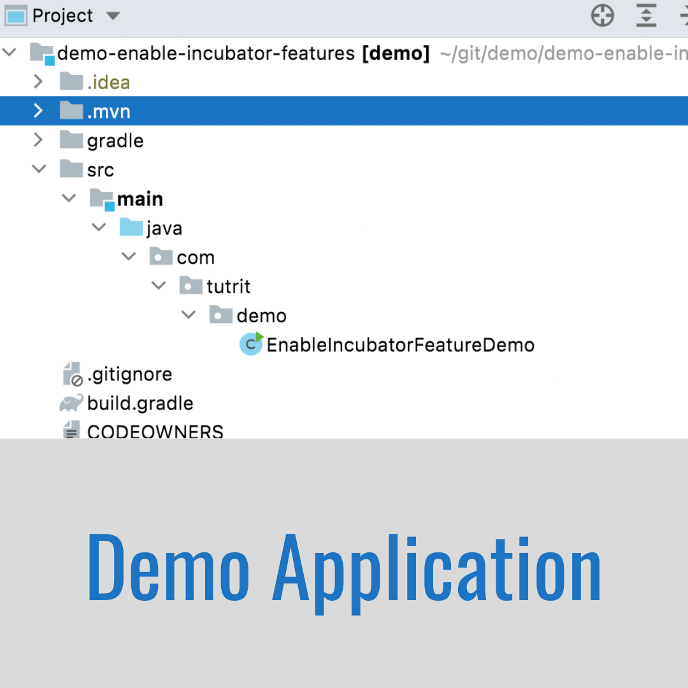

# Java Incubator Modules

<div component="text-block">
To benefit from developer or user feedback on a new APIs or tool in Java, it would be nice to have them enabled in non-final 
state. This will reduce the chance of costly mistakes in the Java SE Platform and the JDK after public release. 

The obvious risk is that someone's code come to depend upon non-final feature and then be broken when run on later release,
in which non-final feature has been modified or even removed. To mitigate that risk such feature should not be resolved 
by default, and at all phases of lifecycle warnings or errors should be issued. 

To achieve that, JEP 11 specified Incubator Modules process. An incubator module is a module in a JDK Release Project 
that offers an incubating feature: the module either exports an incubating API, or contains an incubating tool, or both. 
Such module, API or tool should be identified by the `jdk.incubator` prefix (for tools it is suggested, but not required).
</div>

# The Demo Application

<div component="text-block">

With Java 17 release become available _"JEP 414: Vector API (Second Incubator)"_, so for demo purpose we just import
FloatVector class from incubator module:

```java
public class EnableIncubatorFeatureDemo {

    public static void main(String[] args) {
        System.out.println(FloatVector.SPECIES_PREFERRED);
    }
}
```

The class above listed will be placed in a project with the following structure:
`/demo-enable-incubator-features/src/main/java/com/tutrit/demo/EnableIncubatorFeatureDemo.java`

The Demo Application could be used as a validator of enabling/disabling incubator feature. It could be found at: 
<a href='https://github.com/tutrit/demo-enable-incubator-features'>https://github.com/tutrit/demo-enable-incubator-features</a>. 
</div>

# Enable Incubator Module in Java Compiler 

<div component="text-block">

Preview features enables by passing _add-modules_ arguments to compiler following with the name of the module.

Since the Demo Application is just one java class, it could be run from `demo-enable-incubator-features/src/main/java` 
directory with the following command:

```bash
java --add-modules jdk.incubator.vector com/tutrit/demo/EnableIncubatorFeatureDemo.java 
```

Another way is to compile it first with _add-modules_ flag:

```bash
javac --add-modules jdk.incubator.vector com/tutrit/demo/EnableIncubatorFeatureDemo.java
```

And then run with JVM with the same argument:

```bash
java --add-modules jdk.incubator.vector com.tutrit.demo.EnableIncubatorFeatureDemo
```

</div>

# Enable Incubator Module in IntelliJ IDEA

<div component="text-block">

The Demo Application won't compile in IntelliJ by default with a message that package jdk.incubator.vector is not visible, 
or _NoClassDefFoundError: jdk/incubator/vector/FloatVector_. \
There are two places in configuration that should be modified to change that:

> The error won't go if build tool such as Gradle or Maven is used!

1. at _Run/Debug configuration_ > _VM Options_ add `--add-modules jdk.incubator.vector`
2. at _Preferences_ > _Build, Execution, Deployment_ > _Compiler_ > _Java Compiler_ > _Additional command line parameters_ 
add `--add-modules jdk.incubator.vector`

</div>

# Enable Incubator Module with Maven in pom.xml

<div component="text-block">

In order to enable Incubator Module with Maven, _Maven Compiler Plugin_ should be included in build script file _pom.xml_.
It is used to provide language version and compiler arguments. Here is the configuration:

```xml
<build>
    <plugins>
        <plugin>
            <groupId>org.apache.maven.plugins</groupId>
            <artifactId>maven-compiler-plugin</artifactId>
            <version>3.10.1</version>
            <configuration>
                <source>17</source>
                <target>17</target>
                <compilerArgs>
                    <arg>--add-modules</arg>
                    <arg>jdk.incubator.vector</arg>
                </compilerArgs>
            </configuration>
        </plugin>
    </plugins>
</build>
```

If in IntelliJ you are still getting an error, 
add `--add-modules jdk.incubator.vector`as _VM Options_ at _Run/Debug configuration_.

> The Demo Application doesn't use MANIFEST!

Because the Demo Application doesn't specify main class due to make it as small as possible, to run it after regular packaging with `mvn package`, 
alongside with _--add-modules_ argument a class path should be specified in the run command:

```bash
java --add-modules jdk.incubator.vector -cp demo-0.0.1-SNAPSHOT.jar com.tutrit.demo.EnableIncubatorFeatureDemo
```

</div>

# Enable Incubator Module with Gradle in gradle.build

<div component="text-block">

In order to enable Incubator Module with Gradle, 3 tasks should be included in build script file _gradle.build_ to provide 
arguments to compiler and JVM:

```groovy
tasks.withType(JavaCompile) {
    options.compilerArgs += "--add-modules"
    options.compilerArgs += "jdk.incubator.vector"
}
tasks.withType(Test) {
    jvmArgs += "--add-modules"
    jvmArgs += "jdk.incubator.vector"
}
tasks.withType(JavaExec) {
    jvmArgs += "--add-modules"
    jvmArgs += "jdk.incubator.vector"
}
```

If in IntelliJ you are still getting an error,
add `--add-modules jdk.incubator.vector`as _VM Options_ at _Run/Debug configuration_.

> The Demo Application doesn't use MANIFEST!

Because the Demo Application doesn't specify main class due to make it as small as possible, to run it after regular packaging with `mvn package`,
alongside with _--add-modules_ argument a class path should be specified in the run command:

```bash
java --add-modules jdk.incubator.vector -cp demo-0.0.1-SNAPSHOT.jar com.tutrit.demo.EnableIncubatorFeatureDemo
```

</div>
