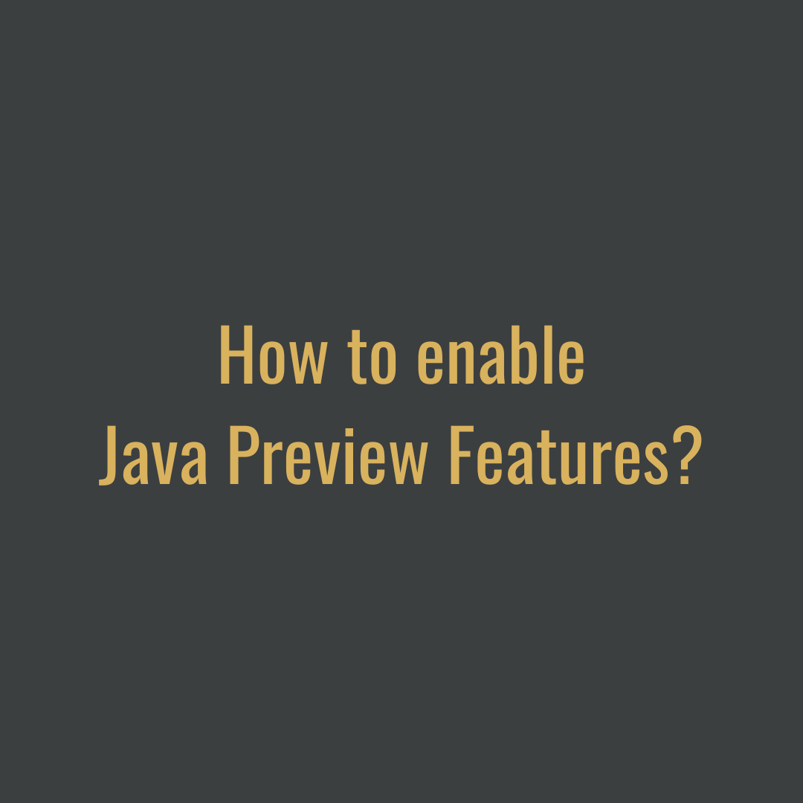
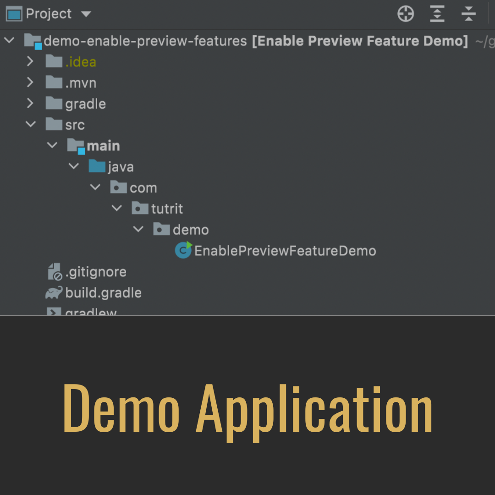
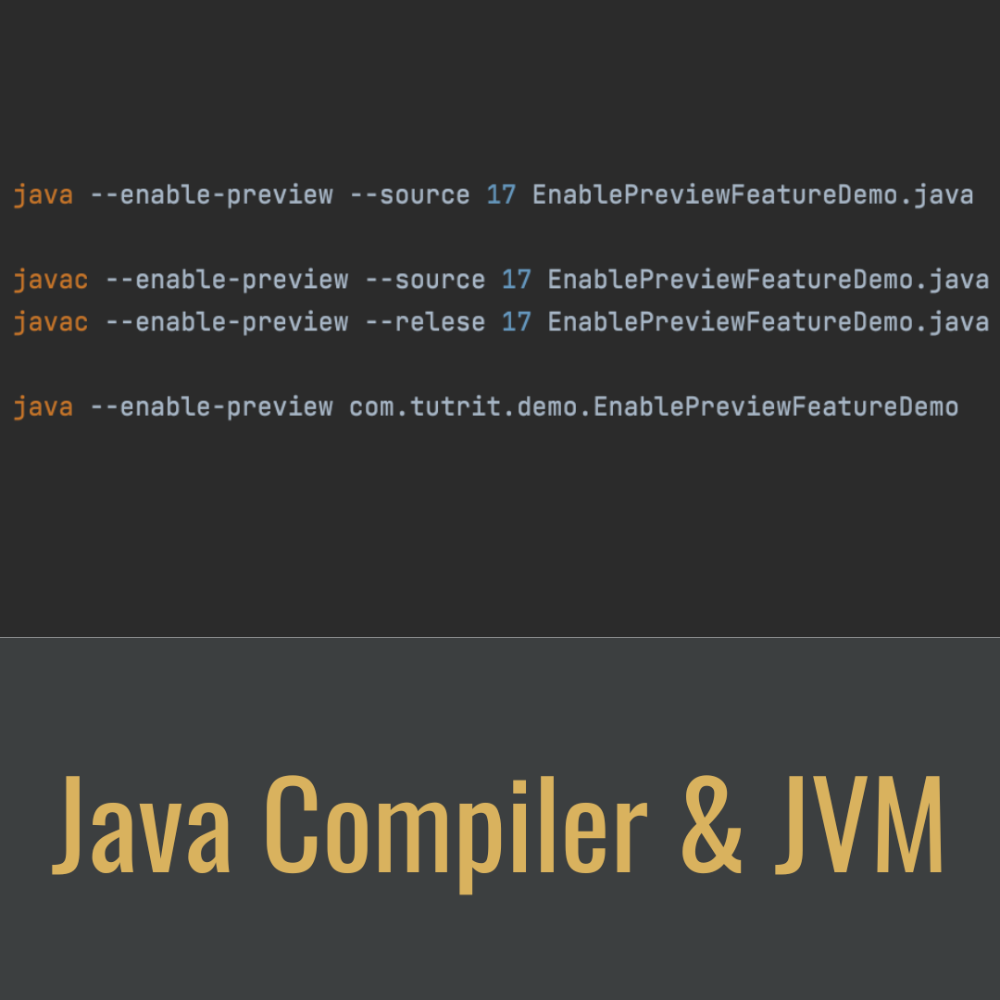
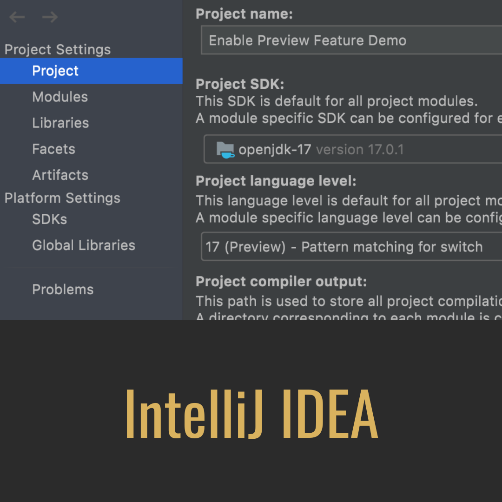
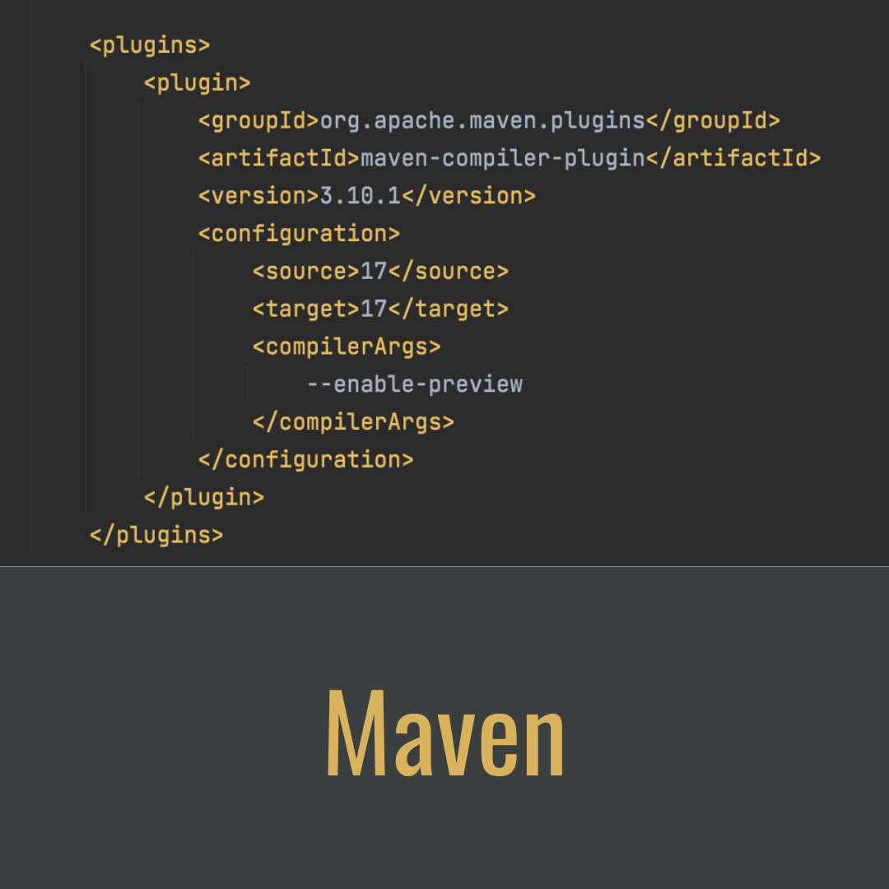
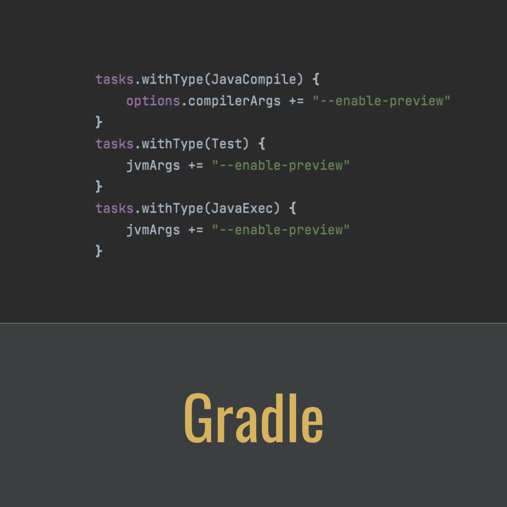

# Java Preview Features

<div component="text-block">
Even before first public release in March 1995, Java community continuously collecting feedbacks to deliver that software
developers have told them they need. One of the processes to achieve that is a Preview Feature, specified in JEP 12.

A preview feature is a new feature whose design, specification, and implementation are complete, but which is not permanent, 
which means that the feature may exist in a different form or not at all in future JDK releases.
</div>

# The Demo Application

<div component="text-block">

With Java 17 release become available _"JEP 406: Pattern Matching for switch (Preview)"_, so we can write something
like this:

```java
public class EnablePreviewFeatureDemo {
    public static void main(String[] args) {
        System.out.println(formatterPatternSwitch(11));
    }

    static String formatterPatternSwitch(Object o) {
        return switch (o) {
            case Integer i -> String.format("int %d", i);
            default        -> o.toString();
        };
    }
}
```

In demo purpose, the class above listed will be placed in a project with the following structure:
`/demo-enable-preview-features/src/main/java/com/tutrit/demo/EnablePreviewFeatureDemo.java`

The Demo Application could be used as a validator of enabling/disabling preview feature. It could be found at: 
<a href='https://github.com/tutrit/demo-enable-preview-features'>https://github.com/tutrit/demo-enable-preview-features </a>. 
</div>

# Enable Preview Feature in Java Compiler 

<div component="text-block">
Preview features enables by passing 2 arguments to compiler: _enable-preview_ and _source_ or _release_.

In order to compile and run java code with preview features, the source/release argument must be the same for JDK release version of 
the compiler and JVM version.

Since the Demo Application is just one java class, it could be run from `demo-enable-preview-features/src/main/java` 
directory with the following command:

```bash
java --enable-preview --source 17 com/tutrit/demo/EnablePreviewFeatureDemo.java
```

Another way is to compile it first with _source_ or _release_ flag:

```bash
javac --enable-preview --source 17 com/tutrit/demo/EnablePreviewFeatureDemo.java
javac --enable-preview --relese 17 com/tutrit/demo/EnablePreviewFeatureDemo.java
```

And then run with JVM without second argument:

```bash
java --enable-preview com.tutrit.demo.EnablePreviewFeatureDemo
```

</div>

# Enable Preview Feature in IntelliJ IDEA

<div component="text-block">
The Demo Application won't compile in IntelliJ by default with a message that _Patterns in switch are not supported at language level '17'_
and recommendation to _Set language level to 17 (Preview) - Pattern matching for switch. 
It could be done from _File -> Project Structure -> Project -> Project language level_

> The error won't go if build tool such as Gradle or Maven is used!

</div>

# Enable Preview Feature with Maven in pom.xml

<div component="text-block">
In order to enable Preview Feature with Maven, _Maven Compiler Plugin_ should be included in build script file _pom.xml_.
It is used to provide language version and compiler arguments. Here is the configuration:

```xml
    <build>
        <plugins>
            <plugin>
                <groupId>org.apache.maven.plugins</groupId>
                <artifactId>maven-compiler-plugin</artifactId>
                <version>3.10.1</version>
                <configuration>
                    <source>17</source>
                    <target>17</target>
                    <compilerArgs>
                        --enable-preview
                    </compilerArgs>
                </configuration>
            </plugin>
        </plugins>
    </build>
```

> The Demo Application doesn't use MANIFEST!

Because the Demo Application doesn't specify main class due to make it as small as possible, to run it after regular packaging with `mvn package`, 
alongside with _enable-preview_ argument a class path should be specified in the run command:

```bash
java --enable-preview -cp demo-0.0.1-SNAPSHOT.jar com.tutrit.demo.EnablePreviewFeatureDemo
```

</div>

# Enable Preview Feature with Gradle in gradle.build

<div component="text-block">
In order to enable Preview Feature with Gradle, 3 tasks should be included in build script file _gradle.build_ to provide 
arguments to compiler and JVM:

```groovy
tasks.withType(JavaCompile) {
	options.compilerArgs += "--enable-preview"
}
tasks.withType(Test) {
	jvmArgs += "--enable-preview"
}
tasks.withType(JavaExec) {
	jvmArgs += "--enable-preview"
}
```

> The Demo Application doesn't use MANIFEST!

Because the Demo Application doesn't specify main class due to make it as small as possible, to run it after regular packaging with `gradle jar`,
alongside with _enable-preview_ argument a class path should be specified in the run command:

```bash
java --enable-preview -cp demo-0.0.1-SNAPSHOT.jar com.tutrit.demo.EnablePreviewFeatureDemo
```

</div>
