# Key dates in Java history
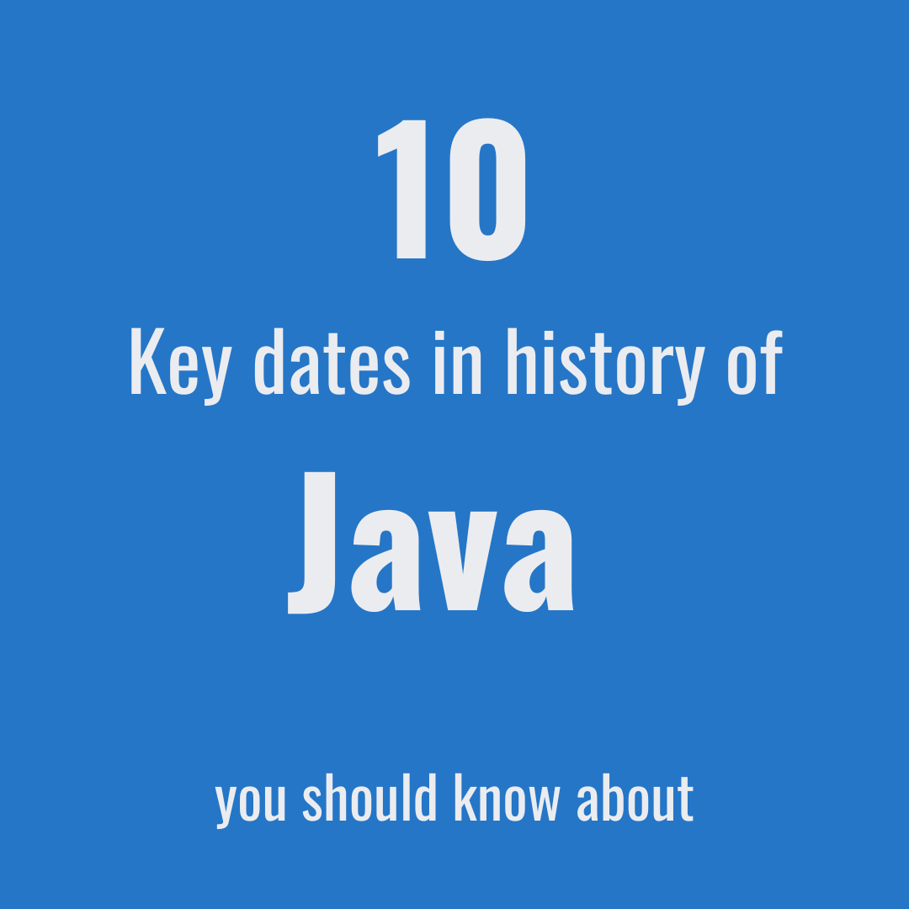

When choosing primary skill language, it's good to know a bit about the story behind it. It helps to understand the community, find origin sources of actual information and, most importantly, to get an idea of future evolution and therefore have a reasonable justification for investing your time in learning the language.  

Talking about Java, it's one of the oldest among the most widely used languages nowadays with no signs of declining in popularity in the foreseeable future, definitely worth the investment your time in it.  

Here are the key events that made it what it is now.

## [1982] Sun Microsystems, Inc foundation
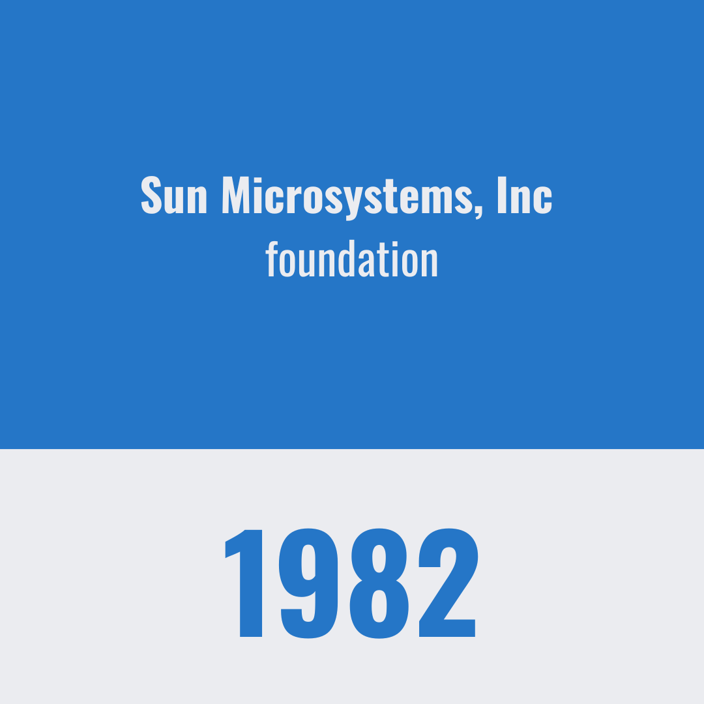

On February 24, 1982, Scott McNealy, Andy Bechtolsheim, and Vinod Khosla, all Stanford graduate students, founded Sun Microsystems. 

The Sun name is derived from the initials of the Stanford University Network.  

At that time Sun sold computers, computer components, software, and information technology, and was known for producing 68k-based systems with high-quality graphics that were the only computers other than DEC's VAX to run 4.2BSD.

## [1984] James Gosling join Sun Microsystems
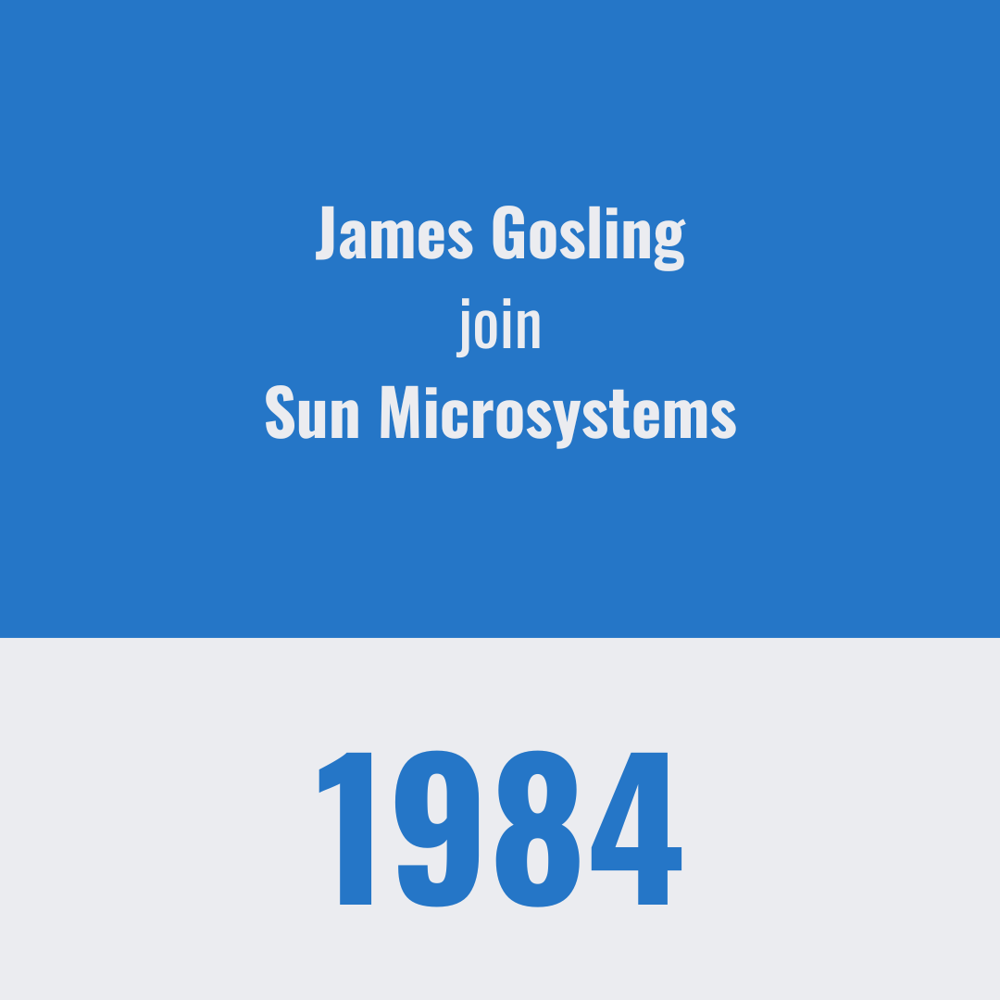

In October of 1984, at the age of 29 years a Canadian computer scientist James Arthur Gosling Gosling started working for Sun Microsystems.  

Before that, He had written a version of Emacs called Gosling Emacs (Gosmacs), built a multi-processor version of Unix for a 16-way computer system, and developed several compilers and mail systems.

## [1991] Java project initiation
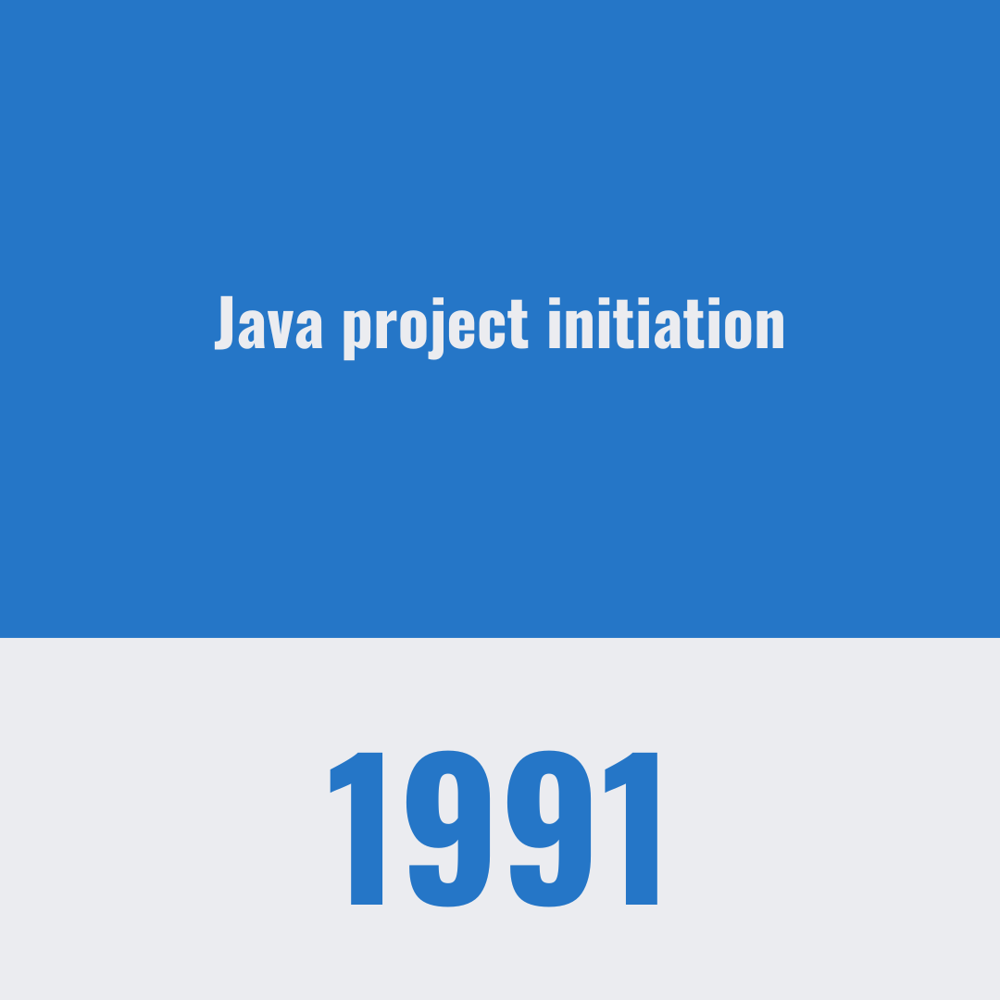

In June 1991, James Gosling, Mike Sheridan, and Patrick Naughton initiated the Java language project. 

Java was originally designed for interactive television.  

The language was initially called Oak after an oak tree that stood outside Gosling's office.  

Later the project went by the name Green and was finally renamed Java, from Java coffee, a type of coffee from Indonesia.

## [1996] Java 1.0 public release
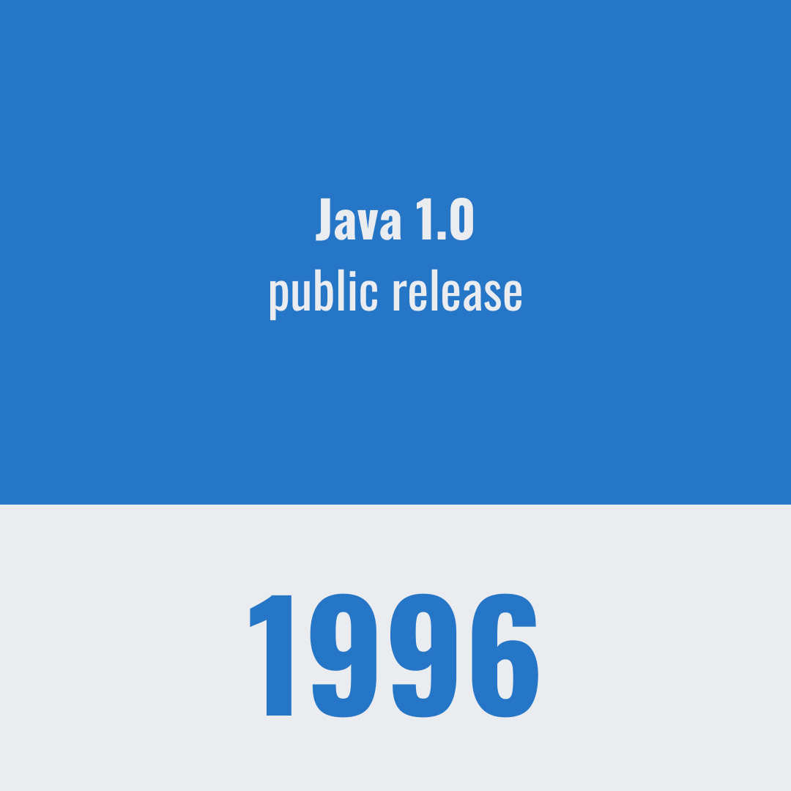

In January 1996, JavaSoft operating company of Sun Microsystems announced that the Java™ 1.0 programming environment is available for download at http://java.sun.com.  

Since March 1995, it has been used already to create hundreds of "applets" or small applications, written on alfa version. 

JavaSoft received a lot of developer feedback and delivered that software developers have told them they need.

## [2007] OpenJDK released under GPL-2.0-only
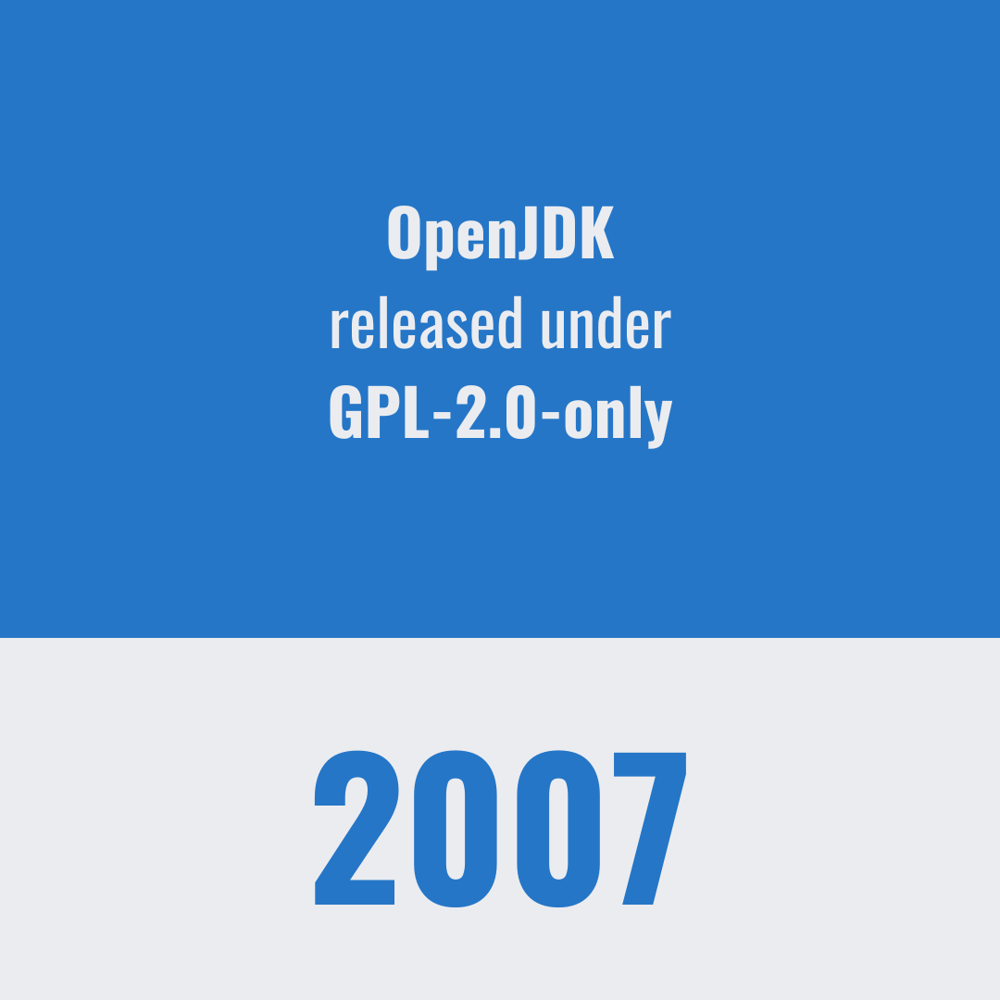

Which is mean Java become free for everyone.  

At JavaOne 2006 conference Sun announced that Java would become open-source software, and on October 25, 2006, at the Oracle OpenWorld conference, 
Jonathan Schwartz said that the company intended to announce the open-sourcing of the core Java Platform.  

Sun released the Java HotSpot virtual machine and compiler as free software under the GNU General Public License on November 13, 2006, 
with a promise that the rest of the JDK (which includes the Java Runtime Environment) would be placed under the GPL by March 2007, 
"except for a few components that Sun does not have the right to publish in source form under the GPL".  

As of May 2007, in compliance with the specifications of the Java Community Process, Sun had relicensed most of its Java technologies under the GPL-2.0-only license.  
Since then, the official reference implementation is the OpenJDK.

## [2010] Oracle became an owner of Java language
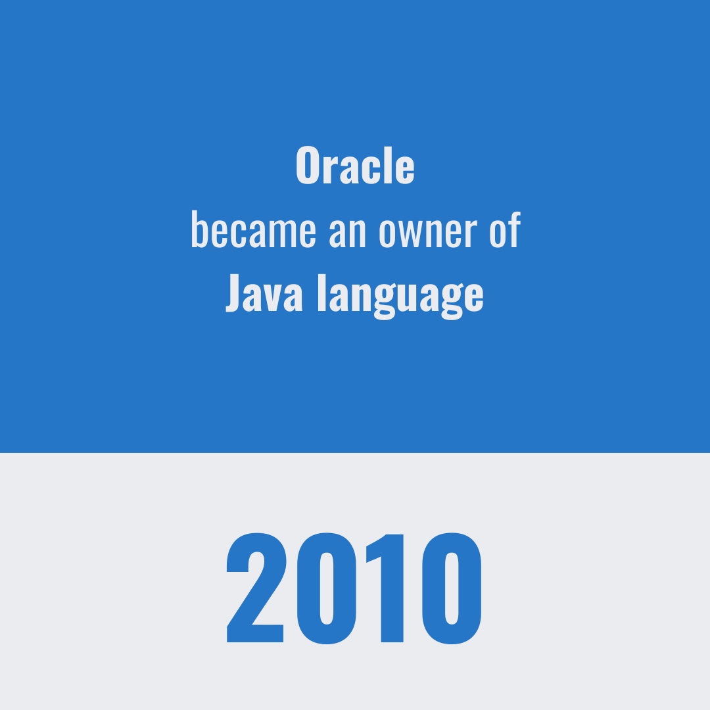

On April 20, 2009, Sun and Oracle announced that they had entered into a definitive agreement under which Oracle would acquire Sun for $9.50 a share in cash.  

Net of Sun's cash and debt, this amounted to a $5.6 billion offer from Oracle. Sun's shareholders voted to approve the proposal on July 16, 2009. 

After the acquisition was completed on January 27, 2010, Oracle, only a software vendor prior to the merger, owned Sun's hardware product lines, including the Java programming language.

## [2014] Java 8 release
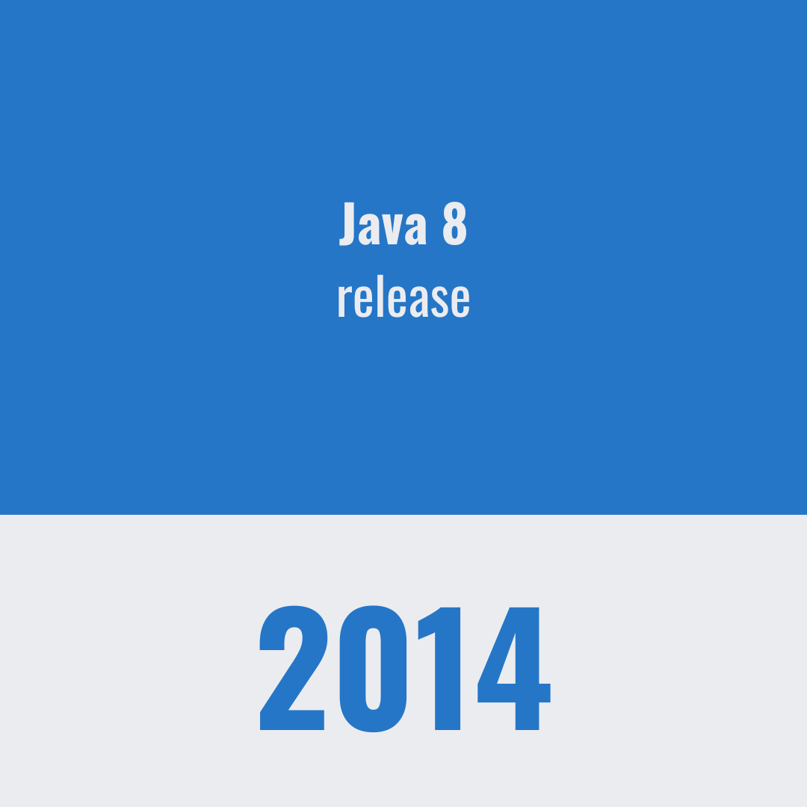

The most significant improvements in Java syntax was introduced with version 8. It was absolutely necessary to keep Java competitive with other languages.  

Basically, it was a major shift towards to functional programming.  

Among them are Functional interfaces, Lambda Expressions and Stream API, that completely changed the way we write Java code. 

## [2019] Since JDK 8u221 Java is under OTN license
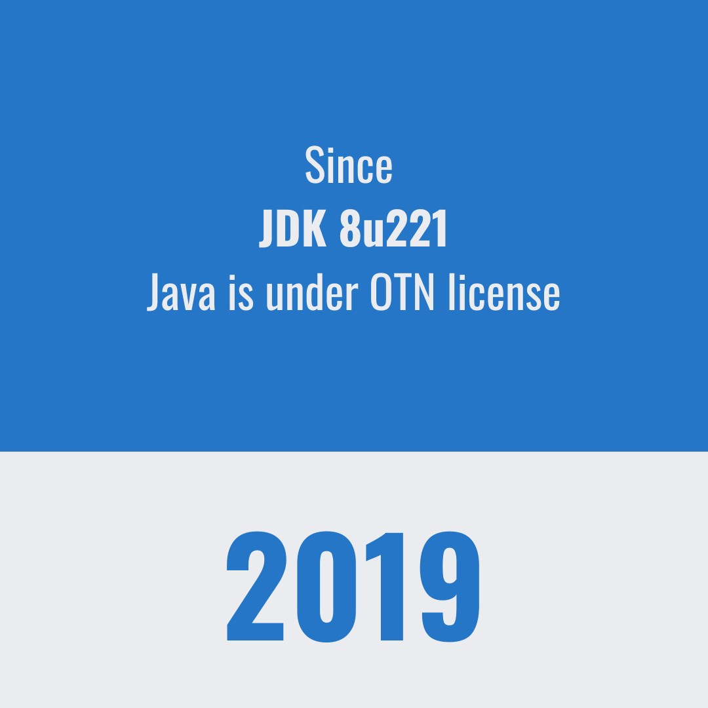

Back in 2018 Oracle decided to stop distributing the Oracle JDK for free and start charging companies for commercial licenses. 

ONT is an Oracle Technology Network License Agreement for Oracle Java SE.  

It means, you may not use Oracle JDK for any data processing or any commercial, production, or internal business purposes other than developing, testing, prototyping, and demonstrating your Application.  

Organizations that wanted to continue using a free version of the JDK were encouraged to adopt OpenJDK.

## [2021] Oracle JDK 17 released under NFTC license
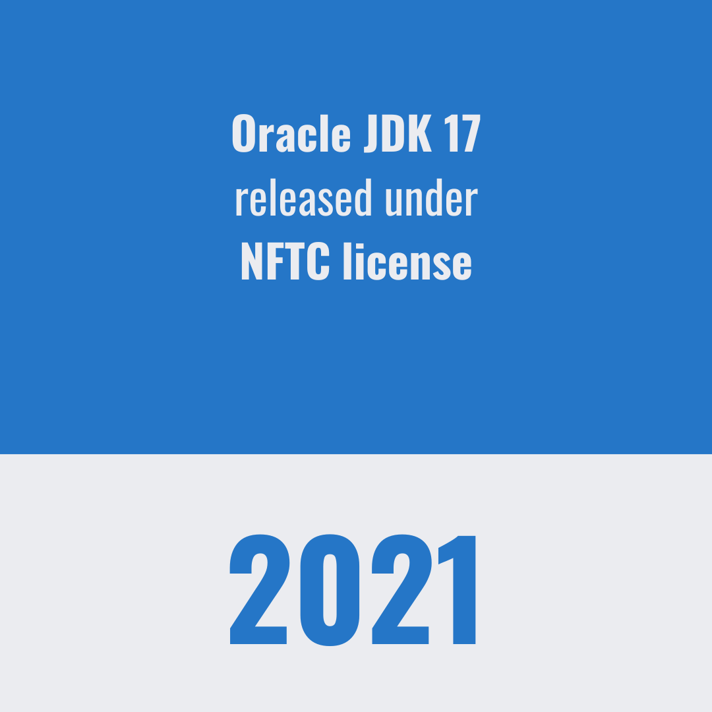

Oracle No-Fee Terms and Conditions license permits free use for all users, even commercial and production use.  

Since the most of the other JDK distributions (such as Amazon Corretto from Amazon, Azul Zulu from Azul Systems, Eclipse Temurin from Adoptium, IBM Semeru from IBM) make their builds based on OpenJDK, we can say that Java is completely free for use.

## [2023] Java 21 LTS release
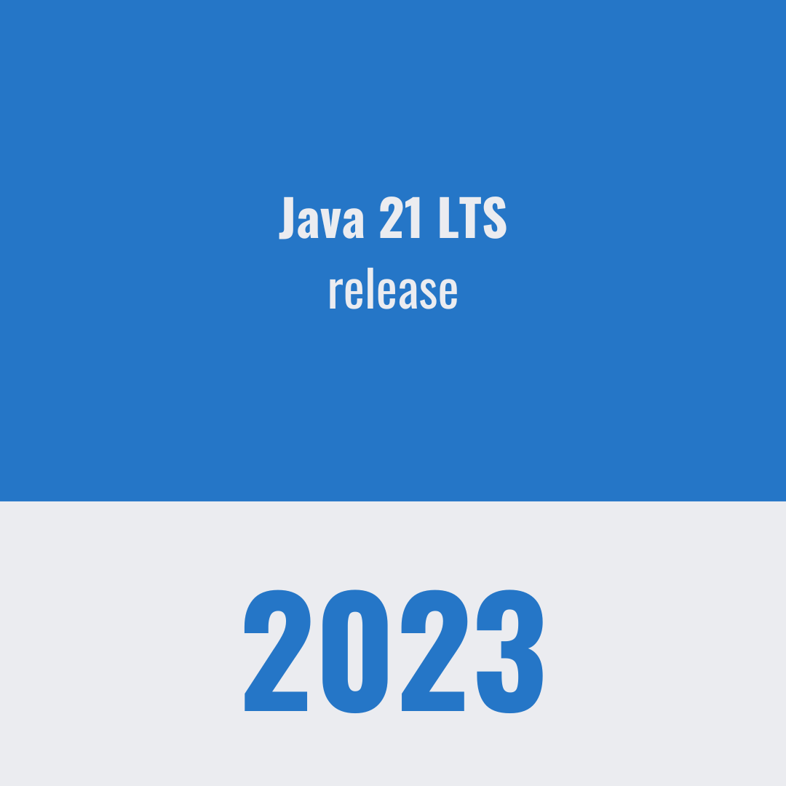

In September, 23 next after Java 17 Long Time Support version should be released.  

Nevertheless, according the latest research I have on current date (i.e. https://www.jetbrains.com/lp/devecosystem-2021/), 72% of Java developers still use Java 8 on their projects.

